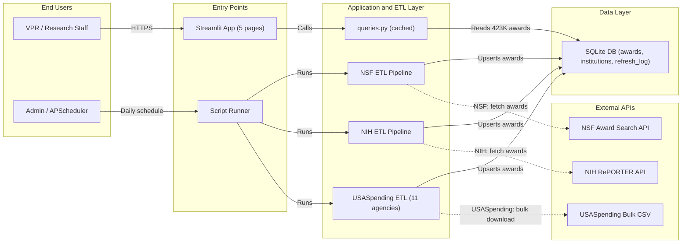

# Federal Radar — System Architecture

## Overview

Federal Radar has two main data flows:

1. **ETL / Ingestion path** — External APIs → ETL scripts → SQLite DB
2. **Read / Presentation path** — Browser → Streamlit → queries.py → SQLite DB

## Architecture Diagram (Mermaid)

## Component Details

### Data Sources
| Source | API | Agencies |
|--------|-----|----------|
| NSF Award Search API | REST + bulk ZIP | NSF (1 agency) |
| NIH RePORTER API | REST | NIH (1 agency) |
| USASpending Bulk CSV | Bulk download | DOD, DOE, ED, NASA, USDA, Commerce, DOT, NEH, EPA, DHS, HHS (11 agencies) |

### Database (SQLite)
| Table | Description |
|-------|-------------|
| `awards` | Unified awards table — 423K+ records, 13 agencies, FY2019–2026 |
| `institutions` | UEI-keyed canonical institution names with peer flags |
| `refresh_log` | ETL run history with timestamps and status |

### Streamlit Pages
| Page | Purpose |
|------|---------|
| Home (Gap Analysis) | Scorecard, gap table, heatmap, Sankey, PDF export |
| Portfolio Risk | Agency concentration, what-if scenarios, peer diversification |
| Expiring Awards | Funding cliff, PI impact, CSV export |
| Action Dashboard | Cross-agency YTD comparison, missed opportunities, lapsed capacity |
| Data Dictionary | Agency abbreviations, field definitions, peer sets |

### ETL Pipelines
| Pipeline | Schedule | Method |
|----------|----------|--------|
| NSF ETL | Daily | Bulk ZIP (historical) + Award Search API (incremental) |
| NIH ETL | Daily | RePORTER API with deduplication |
| USASpending ETL | Weekly | Bulk CSV download per agency |

## Key Design Decisions

- **One unified `awards` table** — `source` column distinguishes agencies; avoids per-agency schema sprawl
- **UEI as dedup key** — cross-source institution matching; never match on name alone
- **Federal fiscal year** — Oct 1 – Sep 30; `obligation_date` is the award received date
- **`raw_json` preserved** — source truth never lost; enables reprocessing without re-fetching
- **`@st.cache_data(ttl=3600)`** on all query functions — SQLite is fast but queries run on every page load

## Figma Diagram

Interactive version: https://www.figma.com/board/cFzSEwM99XekzURJVcADEu
